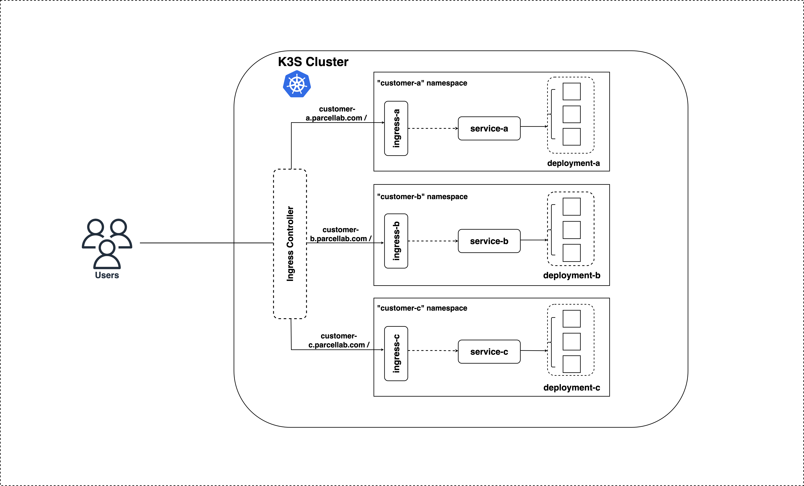

# Challenge

This repository responsible for creating a REST-API which responds with different salutations for different customers. And the application is Containerized and deployed in a selected container orchestrator (`Kubernetes`)

[TLDR;](#-tldr)

[1. Assumptions Made ](#-assumptions-made)

[2. Directory Hierarchy](#-directory-hierarchy)

[3. Application Architecture and the Solution](#-application-architecture-and-the-solution)

[4. Build Deploy and Run ](#-build-deploy-and-run)
- [4.1 Prerequisites](#41-prerequisites)
- [4.2 Run the API](#42-run-the-api) 
    - [4.2.1 Get the most out of Makefile](#421-get-the-most-out-of-makefile)  

[5. Test API Endpoint](#-test-api-endpoint)

[6. Future Improvements](#-future-improvements)

[7. Clean](#-clean)


# 👨‍💻 TLDR; 

You can simply deploy the application on `Kubernetes`. (Make sure [4.1 Prerequisites](#41-prerequisites) are set)

```make
make deploy
```

Once above command is executed, it performs the following actions

1. Install the K3s
2. Build a docker image
3. Export the docker image to to K3s image repository
4. Deploy the helm charts to the K3s Cluster

3 instances of the application will be deployed in 3 different namespaces for each customer

add the following entry to at `/etc/hosts` - IP of the LoadBalancer Service will be output by the above `make deploy` command.

```bash
10.70.1.173 customer-a.parcellab.com customer-b.parcellab.com customer-c.parcellab.com
```

Then access each service with;

```bash
curl -kv http://customer-a.parcellab.com
curl -kv http://customer-b.parcellab.com
curl -kv http://customer-c.parcellab.com
```

You can Test the endpoint of each customer application with;

```make
make test
```

ⓘ For detailed explanations, refer the below sections.

---

## 🤔 Assumptions Made 

As per the requirements, the application is deployed **individually** for each customer. 

> Therefore, the assumptions is to have an Application that is a very generic boilerplate and keep it **DRY** (Don't Repeat Yourself) - i.e. for each customer, it only requires to adjust a very minimum set of configurations to make it more specific to the customer (to get the specific response they expect). By this, application and it's associated resources will be re-usable.

**Therefore this solution is intended to deploy as a single-tenant solution.**

## 📂 Directory Hierarchy 

```
.
├── Makefile
├── README.md
├── app
│   ├── Dockerfile
│   ├── __init__.py
│   ├── main.py
│   ├── requirements.txt
│   └── test_main.py
├── app-chart
   ├── customer-values/A.values.yaml
   ├── customer-values/B.values.yaml
   ├── customer-values/C.values.yaml
   ├── values.yaml
   ├── Chart.yaml
   └── templates
       ├── _helpers.tpl
       ├── deployment.yaml
       ├── ingress.yaml
       └── service.yaml
```

- `Makefile` - Contains a set of rules (commands to build, run and deploy the application) to be executed.

- `app/` - Directory containaining the application logic and relavent resources associated with it.

    - `main.py` - Source code for running the python application containing the API End Point
    - `test_main.py` - A simple test suite to run the application written with `fastapi` test-client
    - `requirements.txt` - A list of all of a project's dependencies
    - `Dockerfile` - Contains instructions to build the Docker image

- `app-chart/` - This directory encompasses the Helm chart for deploying the REST API on Kubernetes. 

> **Note:** In here, we have made the helm chart `DRY` (Don't Repeat Yourself). By this, it means, we are using the same helm chart for different customers. Values are dynamically assigned for each user. `values.yaml` has all the common variables while customer-specific values.yaml files conains customer-specific variables.

The differentaition happens at the ***Values.yaml** level. The more details about this can be read in the [🏠 Application Architecture and the Solution](#-application-architecture-and-the-solution) section

## 🏠 Application Architecture and the Solution



The architecture consists of the following components:

- A container-ready, python-based REST API written using [FastAPI](https://fastapi.tiangolo.com/)
- A local `Kubernetes` cluster provisioned with `K3S`
- A Helm Chart for Kubernetes manifests
- An automated script (`Makefile`) for building and deploying applications

According to the [1. Assumptions Made](#-assumptions-made) above, I believe the best way to make things easy, conveninent and re-usable is to use a solution where it can be DRY (Don't Repeat Yourself). This means, making the logic more re-usable with the minimalistic efforts without re-inventing the wheel again and again for each customer. According to the assumption, each instance (in this context, it is a `Pod`) of the application is responsible for its respective response based on the customer. Therefore, the solution is as below:

## **Solution:**


> Set an ENV variable containing the customer-related metadata (in this case, it is the Customer Name) and inject it into the application where the application logic will read this ENV variable and return the relavent response based on the value of the ENV variable set. Therefore the solution is to create a blue-print, re-use it with the minimal configuration changes (i.e. changing the ENV variable).

**Advantage of this approach is;**

- The deployment team can deploy the same application (blue-print) many times, without changing the underlying application logic at all. And also this solution avoid ammending any query parameters to the URI and avoid any unncessary conditional checkings at the application logic to differentiate the customer.

To automate this process, a `Helm` chart is created with different `Values.yaml` files. Each `Values.yaml` file responsible for each customer-related metadata and importantly carrying the ENV variable value specific ONLY to that customer. 

Since we have 3 different customers, each customer-specific values are stored as below.

- `customer-values/A.values.yaml` - Customer `A` realated deployment variables
- `customer-values/B.values.yaml` - Customer `B` realated deployment variables
- `customer-values/C.values.yaml` - Customer `C` realated deployment variables


```yaml
// customer-values/A.values.yaml
...
labels:
  customer: A
...
```
```yaml
// customer-values/B.values.yaml
...
labels:
  customer: B
...
```
```yaml
// customer-values/C.values.yaml
...
labels:
  customer: C   
...  
```

Inside the `app-chart/templates/deployment.yaml`, a `env` variable is set with the key and value as below:

```yaml
. . .
    spec:
          env:
          - name: CUSTOMER_NAME
            value: {{ .Values.labels.customer }}
. . . 
```

The `{{ .Values.labels.customer }}` will be initialized by `"A"`, `"B"` or `"C"` for each customer respectively. 

And the application logic is written to grasp the value of `CUSTOMER_NAME` and return the appropriate response. 

```python
    CUSTOMER_NAME = os.environ

    . . .          

    greeting_messages = {
        'A': 'Hi!',
        'B': 'Dear Sir or Madam!',
        'C': 'Moin!'
    }

    greeting = greeting_messages.get(CUSTOMER_NAME)

    if greeting:    
        return {'response' : greeting}
```

Here, a hash table is used to improve the application performance and time-complexity. (The response message can also be passed as an environment variable, which is much easier. But since I didn't have much time to change the application logic and the kubernetes manifests, I left the initial code base as it is. This can also be considered for [🔮 Future Improvements](#-future-improvements) )

---
# 🚀 Build Deploy and Run 

## 4.1 Prerequisites

- A Kubernetes Cluster - In this example a simple [K3S](https://k3s.io/) cluster is used (and the commands hereby are based on the `K3S` tool)

Installation:

```make
make install-k3s
```

- [Helm](https://helm.sh/)

- [Docker](https://www.docker.com/)

- [Python 3.x or later](https://www.python.org/downloads/) - If planning to run locally

- [make](https://www.gnu.org/software/make/#download) - >= 3.77

- You are using Linux :) 

## 4.2 Run the API

### 4.2.1 Get the most out of `Makefile`

In this example, for automating the build and deployment process of this application, a `Makefile` is introduced. It is nothing but a file with set of tasks defined to be executed. Consider it as a simple pipeline to automate the manual tasks associated with building, running and deploying the application both locally and in kubernetes. 

**1. Run Locally**

```make
make run
```
This will run the REST API locally for the Customer A. 

> If you want to run it for Customer B or C, set a value for the CUSTOMER_NAME before running `make run` - (eg:- export CUSTOMER_NAME=B)

**2. Build Image & Run**

Since the application is a container-ready application, a `Dockerfile` is used to build the image. This is the most hassle-free solution to share your application and run it anywhere where the Docker is installed. 

Build the Docker image
```make
make build-app
```
Run the Docker container
```make
make run-app
```

Access the applications
```bash
curl -kv http://0.0.0.0:8080
curl -kv http://0.0.0.0:8081
curl -kv http://0.0.0.0:8082
```

**2. Deploy in Kubernetes**

Before deploying the application in `Kubernetes`, make sure you have installed `helm` and `k3s` (and it is up and running) as mentioned in the Prerequsites section above. 

And also since we are using local repository for storing the Docker image of our application, we need to import that image to the K3S's (This is useful for anyone who cannot get k3s server to work with the `--docker` flag). Image will be automatically exported from the local repository to the `K3S` repository with the `make deploy` command

Deploy the application for customer "A", "B", and "C"
```make
make deploy
```

Check the deployed resources
```bash
k3s kubectl get po,svc,ing -n customer-a
k3s kubectl get po,svc,ing -n customer-b
k3s kubectl get po,svc,ing -n customer-c
```

By default `K3S` uses `Traefik` as the ingress-controller.

There are many other tools out there to satisfy the need of an ingress-controller, but to make things super clean, clear and easier, we are using the `Traefik` that comes by-default with `K3S`. 

Traefik creates `LoadBalancer` type Service in the `kube-system` namepsace And since we are using different `Ingress` rules for each customer with custom-domains that doesn't exist, we have to map the custom-domains to Traefik's LoadBalancer Service if we need to access our deployments. To access;

Get the `EXTERNAL-IP` of the Traefik's LoadBalancer type Service

```bash
k3s kubectl get svc -n kube-system | grep traefik

traefik          LoadBalancer   10.43.11.175    10.70.1.173   80:32537/TCP,443:30694/TCP   5h8m
```

Edit the /etc/hosts
```bash
sudo vim /etc/hosts
```
Add the following entry. `10.70.1.173` is the `EXTERNAL-IP` and DNS names are specific to customers and defined in the `Ingress` rules (eg: "`- host: customer-a.parcellab.com`")

```bash
10.70.1.173 customer-a.parcellab.com customer-b.parcellab.com customer-c.parcellab.com
```

Once the entries are added, you can access the each customer application instance as below:

Access the Customer "A" application
```bash
curl -kv http://customer-a.parcellab.com

*   Trying 127.0.0.1:80...
* Connected to customer-b.parcellab.com (127.0.0.1) port 80 (#0)
...
< HTTP/1.1 200 OK
...
* Connection #0 to host customer-b.parcellab.com left intact

{"response":"Hi!"}

```
Access the Customer "B" application
```bash
curl -kv http://customer-b.parcellab.com

*   Trying 127.0.0.1:80...
* Connected to customer-b.parcellab.com (127.0.0.1) port 80 (#0)
...
< HTTP/1.1 200 OK
...
* Connection #0 to host customer-b.parcellab.com left intact

{"response":"Dear Sir or Madam!"}
```
Access the Customer "C" application
```bash
curl -kv http://customer-c.parcellab.com

*   Trying 127.0.0.1:80...
* Connected to customer-b.parcellab.com (127.0.0.1) port 80 (#0)
...
< HTTP/1.1 200 OK
...
* Connection #0 to host customer-b.parcellab.com left intact

{"response":"Moin!"}
```

As mentioned above, the response varies as per the customer

## 📑 Test API Endpoint

Having an automated testing solution to test the API endpoins helps engineers to fix any bugs faster, reduce testing cost amidst the deployment lifecycle, quicker relases and more. 

To test this API endpoint (`/`), a small test case is provided. For this, framework's in-built `FastApi-Test-Client` is used. 

Exeucte the test case
```make
make test
```

Above command create 3 different instances (Docker containers, not Pods) of the application for each customer and test the endpoints of each customer. This can be Considered as pre-deployment testing.

> **Since we are adhering to the Sigle-Tenant approach, we are limited to only test the endpoint for 2 positive (`status_code`, `response`) and 1 negative case (invalid customer)**
**Unlike in a multi-tenancy mode, we could write variety of test cases for different scenarios for different users**


Note: You can also execute into the docker container and test the api endpoint like below:

```python
// execute into the container
docker exec -it hello-app-A bash

// test
pytest
```

## 🔮 Future Improvements
There are several areas that could be improved in the future:

- Extend the application to Maximize robustness with fast startup and graceful shutdown
- Enhance the unit and integration test cases 
- Consider using a managed Kubernetes service such as EKS, AKS or GKE for ease of maintenance and scaling
- Implement continuous integration and delivery pipelines for all applications using CI/CD tools such GitGub actions, Gitlab CI/CD or Jenkins
- Explore the use of GitOps for managing the infrastructure and applications
- Add monitoring and alerting for the entire architecture

## 🧹 Clean

To clean the resources you created, run;

```make
make clean
```